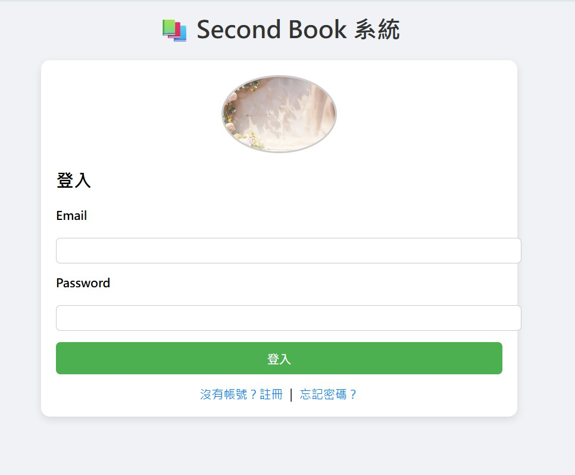

# HW6：系統分鏡板（Storyboard）與欄位規格說明

以下以 **Second Book 系統登入介面** 為例，示範本次作業需繳交之內容格式。

---

## 1️⃣ 分鏡板（Storyboard）

以下以文字示意分鏡板，可替換為組員手繪/電腦繪製圖片。

### 📌 畫面 1：登入頁 Login Page

**目的：**讓使用者輸入帳號與密碼登入系統。

```

```

---

## 2️⃣ 輸入欄位資料型態與驗證規則

以下以「登入畫面」為例：

| 欄位名稱     | Data Type | 驗證規則                                    | 說明       |
| -------- | --------- | --------------------------------------- | -------- |
| Email    | String    | 必填、Email 格式 (`example@xxx.com`)、長度 ≦ 50 | 使用者帳號識別用 |
| Password | String    | 必填、長度介於 6–20、不可含空白                      | 使用者登入密碼  |

---

## 3️⃣ 系統所有螢幕（含此專題畫面）

以下依你提供的「書籍列表頁」與「個人頁」補入：

### 📄 1. 書籍列表頁（首頁）

**功能：**搜尋書籍、依分類瀏覽、查看書籍卡片資訊

**畫面欄位與元件：**

| 元件     | 欄位名稱     | Data Type | 驗證規則        | 功能             |
| ------ | -------- | --------- | ----------- | -------------- |
| 搜尋框    | 書名關鍵字    | String    | 可空白、長度 ≤ 50 | 搜尋書籍標題中含關鍵字    |
| 分類按鈕   | 書籍分類     | Enum      | 必為系統定義分類之一  | 篩選分類，如文學類、商管類… |
| 書籍卡片圖片 | 商品圖片     | Image URL | 必填          | 顯示書籍封面         |
| 書名     | title    | String    | 必填、長度 ≤ 50  | 顯示書名           |
| 價格     | price    | Number    | 必填、>0       | 顯示價格           |
| 語言標籤   | language | Enum      | 中文/英文等      | 書籍語言           |
| 狀態     | status   | Enum      | 待出售/已售出     | 展示商品狀態         |
| 收藏按鈕   | 收藏       | Boolean   | 無           | 加入收藏           |
| 詳細資料按鈕 | 詳細資料     | Button    | 無           | 查看書籍細節         |

---

### 📄 2. 個人頁面（會員中心）

**功能：**管理個人資料、商品、收藏、評價、新增書籍

**畫面欄位與元件：**

| 元件     | 欄位名稱        | Data Type | 驗證規則         | 功能                 |
| ------ | ----------- | --------- | ------------ | ------------------ |
| 大頭貼圖片  | avatar      | Image URL | 可空白          | 顯示使用者頭像            |
| 使用者名稱  | username    | String    | 必填、長度 ≤ 30   | 顯示會員姓名             |
| 個人介紹   | intro       | String    | 可空白、長度 ≤ 200 | 顯示使用者簡介            |
| 新增書籍按鈕 | addBook     | Button    | 無            | 進入上架書籍頁面           |
| 我的商品按鈕 | myItems     | Button    | 無            | 管理上架中的書籍           |
| 我的評論按鈕 | myReviews   | Button    | 無            | 查看使用者評論            |
| 我的收藏按鈕 | myFavorites | Button    | 無            | 查看收藏書籍             |
| 首頁按鈕   | home        | Button    | 無            | 返回書籍列表             |
| 上架書籍清單 | bookList    | Array     | 無            | 顯示使用者上架書籍（若無則顯示提醒） |

---

## 4️⃣ 報表列印欄位

若有報表功能，例如「銷售報表」：

### 📊 銷售報表

| 欄位名稱 | 說明       |
| ---- | -------- |
| 訂單編號 | 系統唯一識別碼  |
| 書名   | 書籍名稱     |
| 賣家帳號 | 銷售此書的使用者 |
| 售出日期 | 訂單完成日期   |
| 金額   | 售出價格     |

---

如需我幫你 **畫真正的 Storyboard 圖片、補上更多頁面、或套用你們專題的實際畫面**，告訴我即可！
